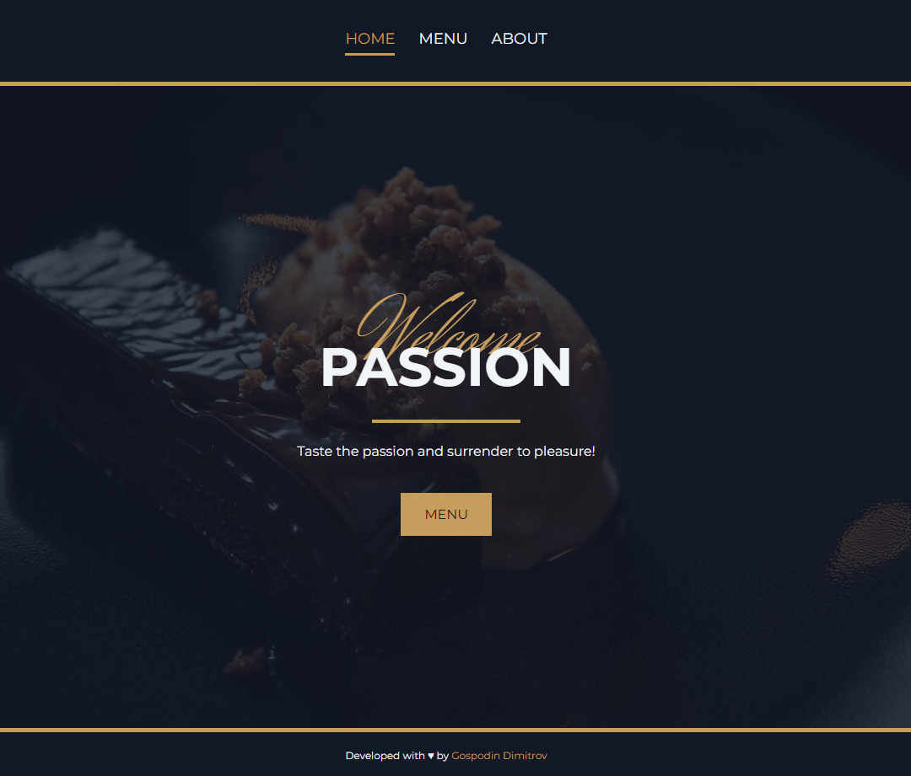

### Project: [Restaurant Page](https://restaurant-gdimitrov.netlify.app/)

Practicing DOM manipulation by dynamically rendering a simple restaurant page. I am using JavaScript alone to generate the entire contents of the website. The project is from The Odin Project [curriculum](https://www.theodinproject.com/lessons/node-path-javascript-restaurant-page).

### Getting Started

In order to setup and work on this project on your own, you will need to:

1. Clone this project:  
   `git clone https://github.com/GDimitroff/restaurant-page.git`

2. Once you have cloned this project, you can install the required dependencies by using:  
   `npm install`

3. A live demo of the project can be started by using:  
   `npm start`

4. Distribution files can be produced using:  
   `npm run build`

### Features

- There are three restaurant pages **generated with JavaScript**
- Each transition is **slightly animated**
- Website has a **responsive layout**

### Outcome

- Used **HTML5 semantic elements** for better structure and readability
- Used **CSS Flexbox** module to create layouts
- Deepened knowledge of **DOM manipulation**
- Improved understanding of **npm** and **git**
- Learned how to organize code with **modules**
- Learned how to bundle the project with **webpack**
- Tried to create a **stylish look**

### Resources

Photos by Silvia Mc Donald, Sérgio Alves Santos, Jennifer Pallian and Marek Piwnicki on Unsplash

